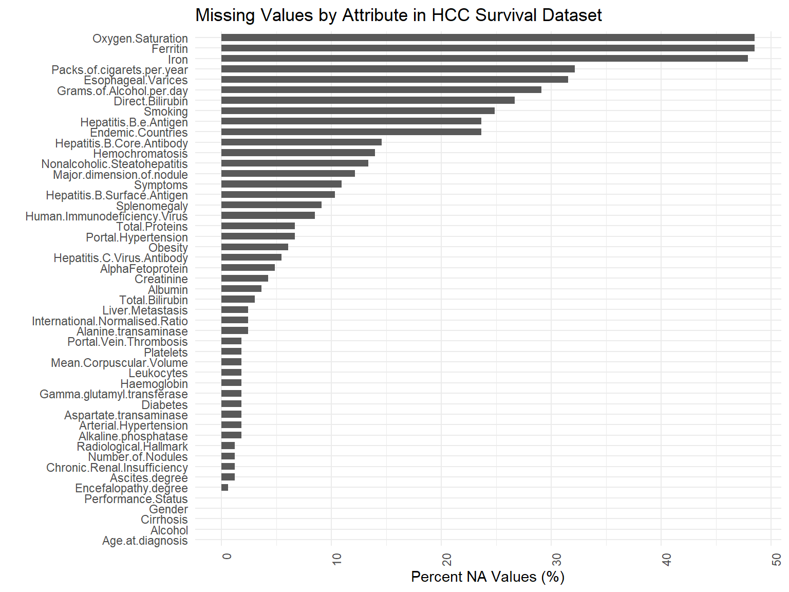
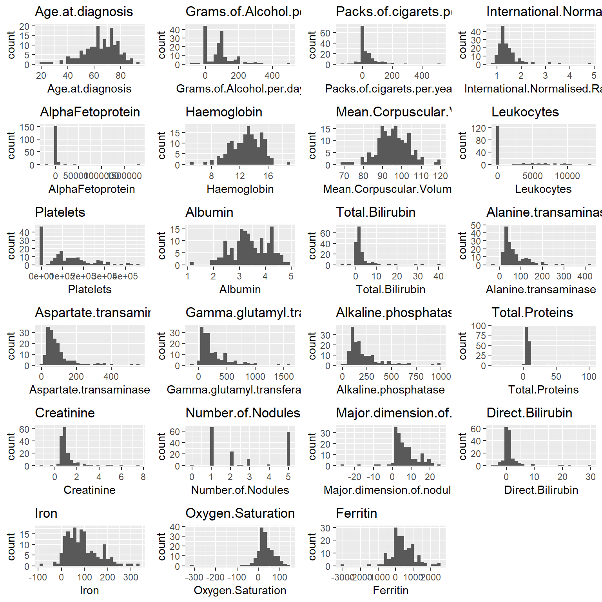
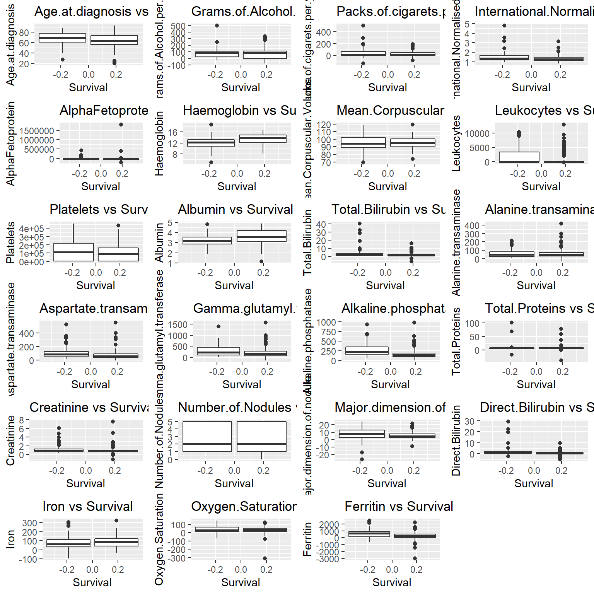
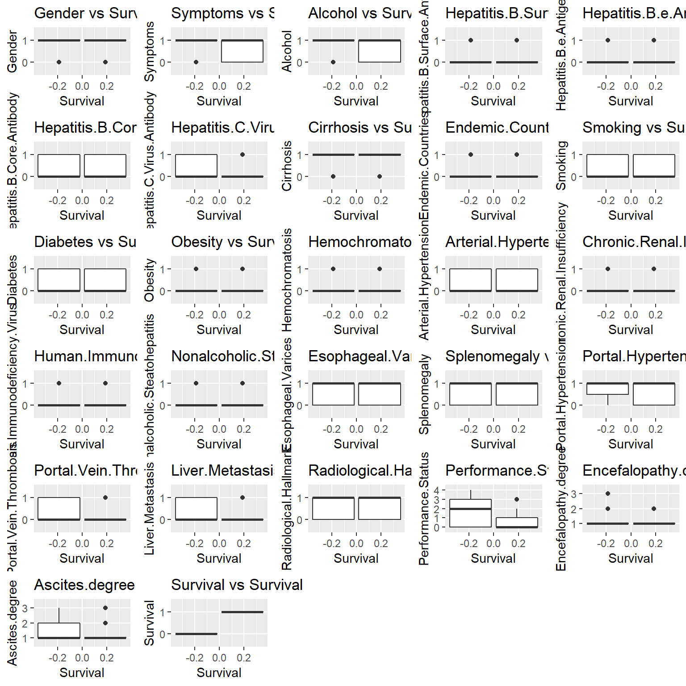

# HCC-Survival

# Introduction

Survival data was collected on patients of liver cancer (Hepatocarcinoma, or HCC) from a University Hospital in Portugal. The response variable is survival at 1 year of initial diagnosis and is classified as lives = 1 and dies = 0\. The dataset contains several demographic, risk factors, and laboratory data of 165 patients that have been diagnosed with HCC. The dataset is heterogeneous with 23 quantitative predictor variables and 26 qualitative predictor variables. Missing values account for 10.22% of the whole dataset with only 8 patients having complete data in all fields.

The problem to answer here is what demographic or clinical data contribute to a patient’s survival of HCC beyond 1 year. To solve the problem, exploratory analysis consisting of finding correlated variables, imputation of missing values, and characterizing the distribution via histograms and boxplots. The entire dataset is then analyzed using several models, including logistic regression, linear discriminant analysis (LDA), quadratic discriminant analysis (QDA), Gaussian finite mixture models using the `mclust` package, random forest, and support vector machines (SVM). Each model was run using the validation set approach (VSA) which splits the data into 50% training set and 50% test set, leave-one-out cross validation (LOOCV), and 5-fold cross validation. From these results, the best performing models (determined by less than 30% test error rate) are run again on a subset of predictors which are chosen using forward and backward stepwise selection. These results are also reported and the best model is chosen.

**Notes on the analysis models:** Since this is survival data, special consideration is required for analysis; namely, that survival data is generally not normally distributed. By breaking the normality assumption, this dataset is not ideal for LDA and QDA; however these models are still run for comparison. Instead, I anticipate this dataset is ideal for either logistic regression, SVM, or non-parametric models, such as kNN. Which of these two models will perform better depends on the shape of the decision boundary. If the decision boundary is linear, then logistic regression can be used. If it is not, kNN would be the model of choice. However, since there are only 165 rows, training data is limited which is not optimal for a kNN model. In that case and if logistic regression cannot be used, then more data collection is required.

The HCC dataset can be found <a href = "https://archive.ics.uci.edu/ml/datasets/HCC+Survival#" target="_blank">here</a>.

**Programming Languages/Software:** R, RStudio

**Skills Used:**  
Machine Learning  
Predictive Modeling 
Imputation of Missing Values

# Exploratory Analysis

## Imputation of Missing Values

The below plot illustrates how many attributes contain `NA` values and what percentage of `NA` make up those attributes. Three attributes in particular contain greater than 40% missing values. This percentage is relatively low compared to other datasets, and therefore none of the attributes are excluded based on missing values alone.

I also verify there are no missing values in the response variable, as these will be meaningless.

    ## [1] "NA values in response variable (Survival): "

    ## NULL

Imputation of missing values is done using the `mice` package. `Nominal` attributes are imputated with the `logreg` method, `ordinal` attributes are imputated with the `polyreg` method, and `continuous` variables are imputated with the `norm` method.

## Correlation Table

Correlated attributes are reported in the table below using a custom function which reports the highest correlated values (Pearson Correlation Coefficient of greater than absolute value of 0.7). `Direct.Bilirubin`, `Oxygen.Saturation`, `Aspartate.transaminase` and `Grams.of.Alcohol.per.day` are excluded from our analysis as these have more missing values than their counterparts. Surprisingly, the Pearson Correlation Coefficient for `Smoking` and `Packs.of.cigarets.per.year` is only 0.436\. Nevertheless, `Packs.of.cigarets.per.year` is exclude as well since it makes sense this attribute is related to `Smoking`.

<table class="table" style="width: auto !important; margin-left: auto; margin-right: auto;"><caption>Correlated Variables for HCC Survival Dataset</caption>

<thead>

<tr>

<th style="text-align:left;"></th>

<th style="text-align:left;">row</th>

<th style="text-align:left;">column</th>

<th style="text-align:right;">cor</th>

<th style="text-align:right;">p</th>

</tr>

</thead>

<tbody>

<tr>

<td style="text-align:left;">1027</td>

<td style="text-align:left;">Total.Bilirubin</td>

<td style="text-align:left;">Direct.Bilirubin</td>

<td style="text-align:right;">0.978</td>

<td style="text-align:right;">0</td>

</tr>

<tr>

<td style="text-align:left;">1128</td>

<td style="text-align:left;">Iron</td>

<td style="text-align:left;">Oxygen.Saturation</td>

<td style="text-align:right;">0.783</td>

<td style="text-align:right;">0</td>

</tr>

<tr>

<td style="text-align:left;">741</td>

<td style="text-align:left;">Alanine.transaminase</td>

<td style="text-align:left;">Aspartate.transaminase</td>

<td style="text-align:right;">0.728</td>

<td style="text-align:right;">0</td>

</tr>

<tr>

<td style="text-align:left;">279</td>

<td style="text-align:left;">Alcohol</td>

<td style="text-align:left;">Grams.of.Alcohol.per.day</td>

<td style="text-align:right;">0.713</td>

<td style="text-align:right;">0</td>

</tr>

</tbody>

</table>

## Histograms and BoxPlots

The following histograms and boxplots illustrate the distribution of each continuous and categorical predictor variable. Interestingly, at first glance of the boxplots for the variable `Number of Nodules`, survival does not seem to be affected by the number of nodules, which is counterintuitive. However, there might be differences in survival based on the variables `Leukocytes`, `Albumin`, `Gamma Glutamyl Transferase`, and `Alkaline Phosphatase`.

# Analysis using Entire Dataset

**Preliminary Findings:** Results for all models are reported in table 2\. SVM performed the best with test error rates less than 25%. Logistic regression, LDA, and MclustDA with modelType=EDDA also performed well with test error rates between 25% and 30%. However, since survival data usually breaks the normality assumption, LDA will no longer be considered.

<table class="table" style="width: auto !important; margin-left: auto; margin-right: auto;"><caption>Model Comparison of Test Error Rates (as percent)</caption>

<thead>

<tr>

<th style="text-align:left;">Method</th>

<th style="text-align:left;">VSA</th>

<th style="text-align:left;">LOOCV</th>

<th style="text-align:left;">Five.fold.CV</th>

</tr>

</thead>

<tbody>

<tr>

<td style="text-align:left;">Logistic Regression</td>

<td style="text-align:left;">31.3</td>

<td style="text-align:left;">27.3</td>

<td style="text-align:left;">27.3</td>

</tr>

<tr>

<td style="text-align:left;">kNN</td>

<td style="text-align:left;">32.5</td>

<td style="text-align:left;">36.4</td>

<td style="text-align:left;">37.0</td>

</tr>

<tr>

<td style="text-align:left;">LDA</td>

<td style="text-align:left;">28.9</td>

<td style="text-align:left;">27.9</td>

<td style="text-align:left;">25.5</td>

</tr>

<tr>

<td style="text-align:left;">QDA</td>

<td style="text-align:left;">39.8</td>

<td style="text-align:left;">40.0</td>

<td style="text-align:left;">41.2</td>

</tr>

<tr>

<td style="text-align:left;">MclustDA</td>

<td style="text-align:left;">49.4</td>

<td style="text-align:left;">49.7</td>

<td style="text-align:left;">40.6</td>

</tr>

<tr>

<td style="text-align:left;">MclustDA, Model Type = EDDA</td>

<td style="text-align:left;">43.0</td>

<td style="text-align:left;">27.9</td>

<td style="text-align:left;">29.1</td>

</tr>

<tr>

<td style="text-align:left;">Random Forest</td>

<td style="text-align:left;">34.9</td>

<td style="text-align:left;">41.3</td>

<td style="text-align:left;">40.9</td>

</tr>

<tr>

<td style="text-align:left;">SVM Linear</td>

<td style="text-align:left;">30.0</td>

<td style="text-align:left;">26.7</td>

<td style="text-align:left;">23.0</td>

</tr>

<tr>

<td style="text-align:left;">SVM Radial</td>

<td style="text-align:left;">40.0</td>

<td style="text-align:left;">38.2</td>

<td style="text-align:left;">38.2</td>

</tr>

<tr>

<td style="text-align:left;">SVM Polynomial</td>

<td style="text-align:left;">30.0</td>

<td style="text-align:left;">36.4</td>

<td style="text-align:left;">23.6</td>

</tr>

</tbody>

</table>

# Stepwise Selection

Since this dataset has many features, prediction accuracy might be improved by selecting for the most relevant features. A subset of predictors is chosen using forward and backward stepwise selection, and then the best performing models (test error rates below 30%) are run again.

## Forward Stepwise Selection

Forward stepwise selection reduces the original 44 predictors to only 23\. The new formula to becomes:

\[ \begin{aligned} Survival &= Alcohol + \\ &Hepatitis.B.Surface.Antigen + \\ &Hepatitis.C.Virus.Antibody + \\ &Smoking + \\ &Diabetes + \\ &Hemochromatosis + \\ &Arterial.Hypertension + \\ &Nonalcoholic.Steatohepatitis + \\ &Splenomegaly + \\ &Portal.Hypertension + \\ &Portal.Vein.Thrombosis + \\ &Age.at.diagnosis + \\ &Performance.Status + \\ &Encefalopathy.degree + \\ &Ascites.degree + \\ &AlphaFetoprotein + \\ &Haemoglobin + \\ &Total.Bilirubin + \\ &Alanine.transaminase + \\ &Alkaline.phosphatase + \\ &Major.dimension.of.nodule + \\ &Iron + \\ &Ferritin \end{aligned} \]

## Backward Stepwise Selection

Backward stepwise selection reduces the original 44 predictors to 22\. The new formula to becomes:

\[ \begin{aligned} Survival &= Alcohol + \\ &Hepatitis.B.Surface.Antigen + \\ &Hepatitis.C.Virus.Antibody + \\ &Smoking + \\ &Diabetes + \\ &Hemochromatosis + \\ &Arterial.Hypertension + \\ &Nonalcoholic.Steatohepatitis + \\ &Splenomegaly + \\ &Portal.Hypertension + \\ &Portal.Vein.Thrombosis + \\ &Age.at.diagnosis + \\ &Performance.Status + \\ &Encefalopathy.degree + \\ &Ascites.degree + \\ &AlphaFetoprotein + \\ &Haemoglobin + \\ &Total.Bilirubin + \\ &Alanine.transaminase + \\ &Alkaline.phosphatase + \\ &Major.dimension.of.nodule + \\ &Ferritin \end{aligned} \]

# Analysis using Subset of Predictors

Results for all models using a subset of predictors are reported in table 3\. Overall, we find a significant reduction in test error rate for all models, with forward stepwise selection performing better than backward stepwise selection, with two exceptions. In general, logistic regression using and SVM performed better than other models and four of those models had test error rates below 20%. SVM using a polynomial kernel and backward step selection performed the best with a test error rate of 18.2%. However, the polynomial kernel uses degree = 1.

<table class="table" style="width: auto !important; margin-left: auto; margin-right: auto;"><caption>Top Performing Models with Subset of Predictors</caption>

<thead>

<tr>

<th style="text-align:left;">Models</th>

<th style="text-align:left;">Forward_Selection</th>

<th style="text-align:left;">Backward_Selection</th>

</tr>

</thead>

<tbody>

<tr>

<td style="text-align:left;">Logistic Regression LOOCV</td>

<td style="text-align:left;">19.4</td>

<td style="text-align:left;">20.6</td>

</tr>

<tr>

<td style="text-align:left;">Logistic Regression 5-fold CV</td>

<td style="text-align:left;">24.8</td>

<td style="text-align:left;">24.8</td>

</tr>

<tr>

<td style="text-align:left;">MclustDA, Model Type = EDDA LOOCV</td>

<td style="text-align:left;">28.5</td>

<td style="text-align:left;">27.3</td>

</tr>

<tr>

<td style="text-align:left;">MclustDA, Model Type = EDDA 5-fold CV</td>

<td style="text-align:left;">26.7</td>

<td style="text-align:left;">26.7</td>

</tr>

<tr>

<td style="text-align:left;">SVM Linear LOOCV</td>

<td style="text-align:left;">20.0</td>

<td style="text-align:left;">20.6</td>

</tr>

<tr>

<td style="text-align:left;">SVM Linear 5-fold CV</td>

<td style="text-align:left;">19.4</td>

<td style="text-align:left;">20.0</td>

</tr>

<tr>

<td style="text-align:left;">SVM Polynomial 5-fold CV</td>

<td style="text-align:left;">19.4</td>

<td style="text-align:left;">18.2</td>

</tr>

</tbody>

</table>

# Final Conclusion

This dataset attempts to find a relationship between several predictor variables in order to be able to predict patients’ survival of HCC beyond 1 year. In our analysis, we have narrowed down the list of 44 predictor variables to just 22 using backward stepwise selection. The proposed model is:

\[ \begin{aligned} Survival &= Alcohol + \\ &Hepatitis.B.Surface.Antigen + \\ &Hepatitis.C.Virus.Antibody + \\ &Smoking + \\ &Diabetes + \\ &Hemochromatosis + \\ &Arterial.Hypertension + \\ &Nonalcoholic.Steatohepatitis + \\ &Splenomegaly + \\ &Portal.Hypertension + \\ &Portal.Vein.Thrombosis + \\ &Age.at.diagnosis + \\ &Performance.Status + \\ &Encefalopathy.degree + \\ &Ascites.degree + \\ &AlphaFetoprotein + \\ &Haemoglobin + \\ &Total.Bilirubin + \\ &Alanine.transaminase + \\ &Alkaline.phosphatase + \\ &Major.dimension.of.nodule + \\ &Ferritin \end{aligned} \]

There is indication that the shape of the decision boundary is in fact linear since the best performing models are SVM with a polynomial kernel adn degree = 1, SVM with linear kernel, and logistic regression. Additional data can potentially vastly improve the approximately 20% test error rate, and all three models should be reevaluated to determine the best model. In doing so, this data and prediction model will help doctors determine a particular patient’s stage of HCC, and therefore determine best course of treatment.

 
